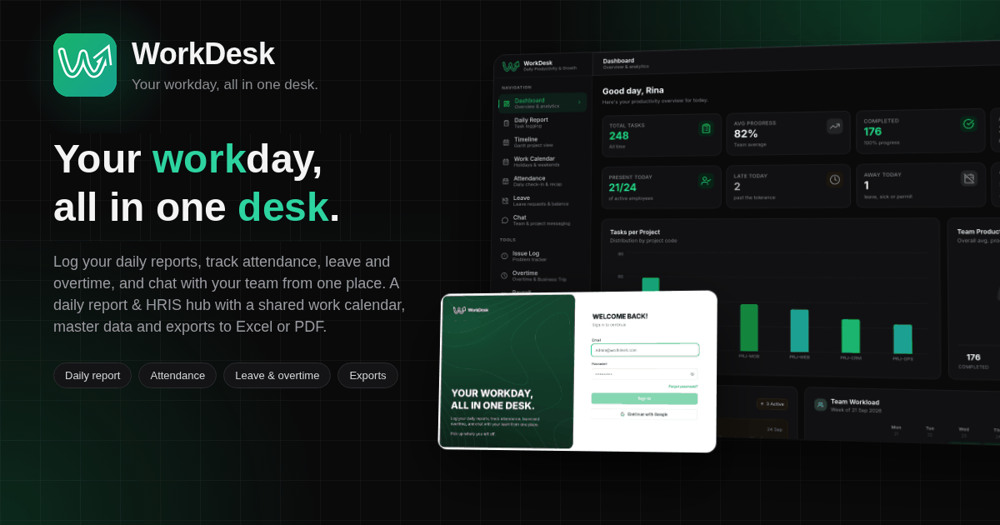

# WorkDesk



**Your workday, all in one desk.** WorkDesk is a daily reporting and HRIS app
for small teams. Employees log what they worked on, clock in, request leave
or overtime, and chat with the team in one place. Managers see progress,
blockers and attendance without chasing anyone for a spreadsheet.

**Live demo:** [workdesk.mujahidin.my.id](https://workdesk.mujahidin.my.id)

## The problem it solves

In many small companies, daily reports go into a WhatsApp group, attendance
goes into a spreadsheet, and leave requests get approved by chat. Nobody can
say how far along a project is or who was late last month without digging.
WorkDesk puts all of it in one place, and the numbers update themselves from
what people already log.

**Daily work**

- **Daily Report**: each employee logs tasks per project with progress and
  any blocker. Teammates can discuss a task in its comments.
- **Dashboard**: total tasks, average progress, tasks per project, team
  workload and today's attendance, all calculated from the reports. There is
  nothing to fill in.
- **Timeline**: a Gantt chart of every project, with progress taken from the
  daily reports.
- **Issue Log**: every blocker written in a report shows up here until
  someone marks it resolved.

**HR**

- **Attendance**: a check-in prompt appears on the first visit of each working
  day. The app flags late clock-ins against the work schedule, and admins can
  lock a past period so its records can no longer change.
- **Leave**: annual leave, permission and sick requests with an approval flow
  and a yearly leave balance.
- **Overtime and business trips**: requests go to a Manager or Admin for
  approval, then feed into compensation.
- **Payroll**: a monthly payroll run built from base salary plus approved
  overtime and trips, with payslips. A finalized run can no longer be edited.
- **Work calendar**: weekends are marked automatically, national holidays sync
  in one click, and company days off can be added by hand.

**Team and admin**

- **Chat**: threads, replies, reactions, mentions, file sharing and online
  status.
- **Notifications**: live alerts when a request is approved or rejected.
- **Master data**: projects, employees, user accounts, per-feature access and
  an audit log of changes to attendance, leave, overtime and access.
- **Export**: reports to Excel or PDF for meetings and archives.
- **Bilingual and themed**: Indonesian and English, light and dark mode, and
  an in-app guide with a walkthrough for each page.

## Roles

| Role     | What they can do                                                       |
| -------- | ---------------------------------------------------------------------- |
| Employee | Log reports, clock in, submit requests, see their own payslip          |
| Manager  | Everything an Employee can, plus approve requests and see the team     |
| Admin    | Manage master data, users, access, schedule, payroll and the audit log |

A user can only change the role of someone ranked below them, and never their
own.

## Security

All permissions are enforced in the database with Postgres Row Level Security
and triggers, not only in the UI. Even a request sent straight to the API
cannot read someone else's payslip, approve its own request, or edit a locked
period. The UI only hides buttons the database would refuse anyway. SQL smoke
tests in `supabase/tests/` check these rules.

## Tech stack

React 19, TypeScript, Vite, Tailwind CSS, shadcn/ui, TanStack Query and
i18next on the front end. Supabase (Postgres, Auth, Storage, Realtime, Edge
Functions) on the back end. Deployed on Vercel.

## Running locally

Requires Node 24 and pnpm.

```bash
cp .env.example .env    # fill in your Supabase URL and publishable key
pnpm install
pnpm dev                # http://localhost:8080
```

`GUIDELINE.md` explains the code layout and where new code goes.

## License

MIT © [Mujahidin](https://mujahidin.my.id) ([@mujahidinnn](https://github.com/mujahidinnn)). See `LICENSE`.
